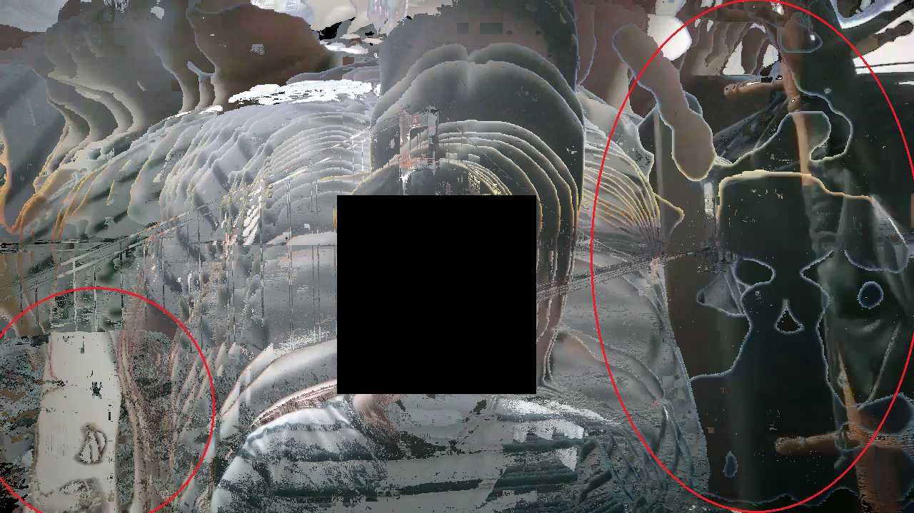
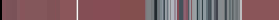
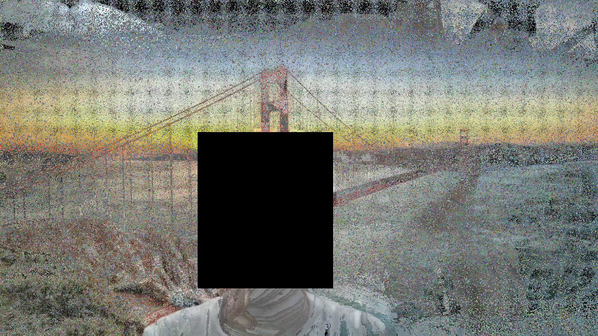
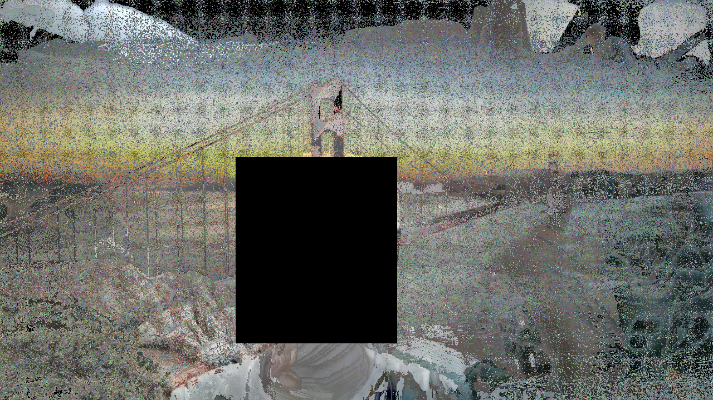

# Roomg
Roomgとはバーチャル背景と体などのオブジェクトとの境界の色情報を抽出して、背後に隠れた部屋を自動で復元する技術である。  
**関連記事**  
[【手動】バーチャル背景が適用された動画から部屋の背景画像を復元する話](https://github.com/satoki/articles/tree/master/【手動】バーチャル背景が適用された動画から部屋の背景画像を復元する話)  

## 手法
はじめに理想的な動画を用いての説明を行い、その後に実際の動画に適用する。  
理想的な動画とはバーチャル背景が赤色、オブジェクトが黄色、部屋が水色である[sample_01.mp4](tools/sample_01.mp4)をいう。  
ここではオブジェクトが右から左へ横切ることを想定している。  
  
※フレーム数確保のため速度を落としている  

### アルゴリズム
基本的な考え方としては、バーチャル背景が部屋を即座に隠すことを利用し、各ピクセルごとに出現時間が短い色を選ぶことで部屋を復元する。  
以下の画像は理想的な動画の同一部分を拡大し並べたものである。  
")  
バーチャル背景とオブジェクトの色には部屋の色よりも幅があり長時間表示されているため、出現頻度が高くなりやすい。  
よって、最も出現頻度が低い水色が、部屋の色だと決定できる。  
実際にはピクセルごとに処理を行うため、ある程度のフレーム数が必要である。  
以下の画像は理想的な動画の座標500,500の色を時間軸を横にとり、並べたものである。  
")  
水色が最も少ないことがわかる。  
フレーム数と動画長が増加するほど、復元の精度が向上する。  
問題はバーチャル背景と部屋の色が境界で混ざり合う場合である。  
これはバーチャル背景と部屋の色差を利用して、排除している。  
バーチャル背景は先に説明した部屋の復元の逆、最も出現頻度が高い色を選択することで取得できる。  
今後、色差計算が精度向上に大きく影響する可能性がある。  

### コード
**roomg.py**  
```python:roomg.py
import cv2
import sys
import time
import numpy
import collections
from tqdm import tqdm

args = sys.argv
filename = args[1]

video = cv2.VideoCapture(filename)
if not video.isOpened():
    print("c('o'c)")
    print("plz {}".format(filename))
    sys.exit()

h = int(video.get(cv2.CAP_PROP_FRAME_HEIGHT))
w = int(video.get(cv2.CAP_PROP_FRAME_WIDTH))
f = 0 #int(video.get(cv2.CAP_PROP_FRAME_COUNT))

frame = []
while True:
    ret, tmp = video.read()
    if not ret:
        break
    f += 1
    frame.append(tmp)

print("c('-'c)")
print("-" * 50)
print("Height:{}\nWidht:{}\nFrame:{}".format(h, w, f))
print("-" * 50)
omg = int(input("omg:"))
print("-" * 50)

omgc = 0
image = [[0] * w for i in range(h)]

bar = tqdm(total = h * w)
bar.set_description('Progress')

start = time.time()

#"""
for i in range(h):
    for j in range(w):
        colors = []
        most = []
        n = -1
        for k in range(f):
            colors.append(str(frame[k][i][j].tolist()))
        for k in (collections.Counter(colors).most_common()[0][0]).replace("[", "").replace("]", "").split(', '):
            most.append(int(k))
        while True:
            least = []
            for k in (collections.Counter(colors).most_common()[n][0]).replace("[", "").replace("]", "").split(', '):
                least.append(int(k))
            n -= 1
            if most == least:
                least = []
                for k in (collections.Counter(colors).most_common()[-1][0]).replace("[", "").replace("]", "").split(', '):
                    least.append(int(k))
                break
            if abs(sum(most) - sum(least)) > omg:
                omgc += 1
                break
        image[i][j] = numpy.array(least)
        bar.update(1)
    #print("{}/{}:{:.2f}s".format(i + 1, h, time.time() - start))
#"""

bar.close()

print("omgc:{}".format(omgc))
print("Time:{:.2f}".format(time.time() - start))
print("-" * 50)

cv2.imwrite('{}_room_{}.png'.format(filename.replace(".mp4", ""), omg), numpy.array(image))

print("b(^0^b)")
```

### 理想的な動画
[手法](#手法)で使用した[sample_01.mp4](tools/sample_01.mp4)および、部屋部分を写真に変更した[sample_02.mp4](tools/sample_02.mp4)にRoomgを適用する。  
復元された画像は以下になる。  
**sample_01**  
部屋部分  
  
500,500の時間変化  
  
**sample_02**  
部屋部分  
  
500,500の時間変化  
  
共にパラメータを20とした。  
フレーム数の関係でバーチャル背景のみとなったピクセルは縦の線として現れている。  
オブジェクトと同色のクラスタはパラメータ調整により削減できる。  
パラメータを5としたsample_02の部屋部分を以下に示す。  
  

### 実際の動画
実際のzoomから得られた[動画](tools/zoom_0.zip)にRoomgを適用する。  
復元された画像は以下になる。  
**zoom_0**  
部屋部分(顔黒塗り)  
  
以下の実際の部屋と比べると、赤く囲った部分が復元できていることがわかる。  
実際の部屋  
  
500,500の時間変化  
  
パラメータを90とした。  
フレーム数の関係で腕などの表示時間が短いため、背景と判定されている。  
大幅にバーチャル背景が乱れる現象も復元には大きく影響している。  

## 対抗手法
グリーンバックを使えば部屋の情報が漏れる心配はない。  
技術的な対策としては、バーチャル背景を不規則に動かすことが挙げられる。  
規則的に動く場合、バーチャル背景のピクセルが累積してしまうので動画時間によっては復元される恐れがある。  
バーチャル背景の画像を十分長さのある動画とし、色と場所をランダムにしたノイズピクセルをばらまくことで機械的な復元を妨げることができる。  

### フレーム単位のノイズ
[手法](#手法)で使用した[sample_01.mp4](tools/sample_01.mp4)をフレーム単位で分割し、1つのフレームのバーチャル背景部分をノイズ[image_123.png](tools/image_123.png)に変更したものを再度動画にした[sample_03.mp4](tools/sample_03.mp4)にRoomgを適用する。  
フレーム単位で挿入するため、オブジェクトが動いた後の動画後半に挿入した。  
これは得られた部屋の情報がノイズによってかき消されることを意味している。  
復元された画像は以下になる。  
**sample_03**  
部屋部分  
  
500,500の時間変化  
  
1000,1000の時間変化  
  
パラメータを20とした。  
ノイズによって復元が妨げられていることがわかる。  

### ピクセル単位のノイズ
フレーム単位のノイズでは、フレームを削除することにより容易に復元が可能となる。  
これを防ぐため、バーチャル背景のランダムな箇所へピクセル単位でのノイズを挿入する。  
ノイズのピクセルサイズをもランダムにすることで予測を困難にすることができるが、動画の質が低下してしまう。  
本対策ではバーチャル背景の認識に影響を与えない程度のノイズを目指し、ノイズの座標と量をランダムに散りばめることとした。  
ノイズを含ませたバーチャル背景用動画[noises.mov](tools/noises.mov)をzoomのバーチャル背景として使用した[動画](tools/zoom_1.zip)にRoomgを適用する。  
動画は[zoom_vbg.png](tools/zoom_vbg.png)より生成したもので、読み込みの関係でmovへの変換を行った。  
**zoom_1**  
部屋部分(顔黒塗り)  
  
  
500,500の時間変化  
  
上の画像をパラメータ60、下の画像をパラメータを90とした。  
ノイズにより部屋の復元がさらに困難になっていることがわかる。  

### コード
**itonv.py**  
```python:itonv.py
import cv2
import sys
import copy
import random

filename = sys.argv[1]

frame = int(input("frame:"))
fps = float(input("fps:"))

image = cv2.imread(filename)
h = len(image)
w = len(image[0])

randlist = []
for i in range(h):
    for j in range(w):
        randlist.append((i,j))

random.shuffle(randlist)

video = cv2.VideoWriter("itonv_{}_{}.mp4".format(filename.replace(".png",""), fps), cv2.VideoWriter_fourcc('m','p','4', 'v'), fps, (w, h))

print("o('x'o)")

##############################
probability = 100000
##############################

count = 0
frame_c = 0
pixels = h * w #len(randlist)
image1 = copy.deepcopy(image)
while True:
    if count >= pixels - 1:
        random.shuffle(randlist)
        count = 0
    if not random.randrange(probability):
        if frame_c >= frame:
            break
        video.write(image1)
        frame_c += 1
        print(frame_c)
        image1 = copy.deepcopy(image)
        ##############################
        no_noises_frames = 5
        ##############################
        if frame_c + no_noises_frames>= frame:
            no_noises_frames = frame - frame_c
        for i in range(no_noises_frames):
            video.write(image)
            frame_c += 1
            print(frame_c)
    else:
        for i in range(3):
            image1[randlist[count][0]][randlist[count][1]][i] = random.randrange(255)
        count += 1

video.release()

print("OK")
```

## ツール群
使用したツールとその機能および使用方法をまとめる。  
例として[手法](#手法)で使用した[sample_01.mp4](tools/sample_01.mp4)と[対抗手法](#対抗手法)で使用した[zoom_vbg.png](tools/zoom_vbg.png)を用いる  
**roomg.py**  
room + omg  
バーチャル背景適用済み動画(sample_01.mp4)から部屋の画像(sample_01_room_40.png)を作成する。  
[手法](#手法)を実現するツール。  
パラメータ`omg`により精度が変化する。  
今後`if abs(sum(most) - sum(least)) > omg:`を改良する必要がある(現状では後ろの時間のピクセルに重みがかかっている)。  
```bash
$ python3 roomg.py sample_01.mp4
c('-'c)
--------------------------------------------------
Height:1080
Widht:1920
Frame:608
--------------------------------------------------
omg:40
--------------------------------------------------
Progress: 100%|██████████████████████████████████████████████████████| 2073600/2073600 [26:30<00:00, 1303.99it/s]
omgc:2073600
Time:1590.20
--------------------------------------------------
b(^0^b)
```
**vtois.py**  
video to images  
動画(sample_01.mp4)をフレームに分解し、ディレクトリ(sample_01_images)に画像(sample_01_フレーム番号.png)として保存する。  
```bash
$ python3 vtois.py sample_01.mp4
o('3'o)
f:608
OK
```
**istov.py**  
images to video  
複数のフレーム画像を含んだディレクトリ(vtois.pyで分解したものを想定)を選択し、そのフレームから動画(sample_01_istov.mp4)を生成する。  
```bash
$ python3 istov.py
Directory Name:sample_01_images
h:1080
w:1920
fps:60.6
o('4'o)
OK
```
**randpxs.py**  
random pixels  
ノイズフレーム用にノイズで埋め尽くされた画像(image_31415.png)を一枚生成する。  
seedを選択できる。  
```bash
$ python3 randpxs.py
h:1080
w:1920
seed:31415
o('p'o)
OK
```
**itonv.py**  
image to noisy video  
画像(zoom_vbg.png)からピクセルノイズ入りの動画(itonv_zoom_vbg_0.5.mp4)を作成する。  
[対抗手法](#対抗手法)を実現するツール。  
`probability = 100000`を減少させ、`no_noises_frames = 5`を増加することでノイズを目立たなくすることができる(同動画長で比較すると復元精度が上がる)。  
```bash
$ python3 itonv.py zoom_vbg.png
frame:5
fps:0.5
o('x'o)
1
2
3
4
5
OK
```
**xy_check.py**  
xy check  
動画(sample_01.mp4)のxとyに指定したピクセル座標の色を時間的に画像(sample_01_200_100_check.png)にまとめる。  
```bash
$ python3 xy_check.py sample_01.mp4
h:200
w:100
o('^'o)
f:608
OK
```