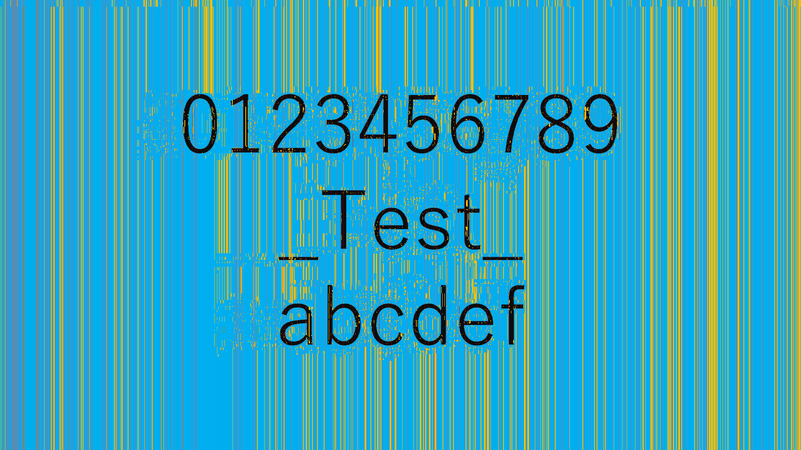
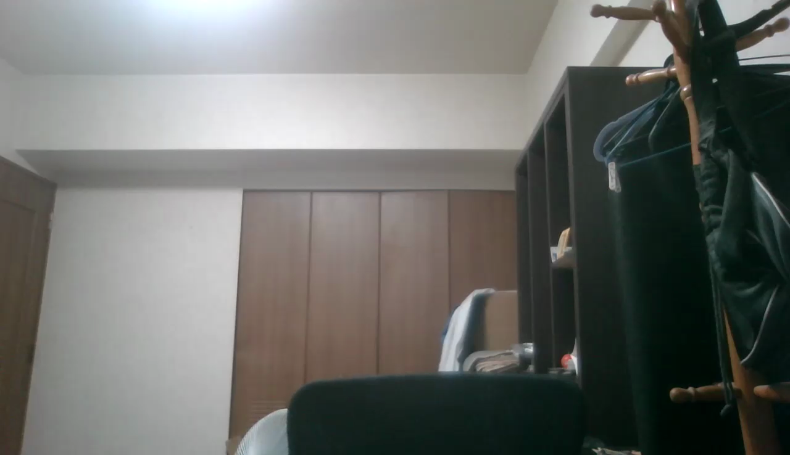

# Roomg
Roomgとはバーチャル背景と体などのオブジェクトとの境界の色情報を抽出して、背後に隠れた部屋を自動で復元する技術である。  
**関連記事**  
[【手動】バーチャル背景が適用された動画から部屋の背景画像を復元する話](https://github.com/satoki/articles/tree/master/【手動】バーチャル背景が適用された動画から部屋の背景画像を復元する話)  

## 手法
はじめに理想的な動画を用いての説明を行い、その後に実際の動画に適用する。  
理想的な動画とはバーチャル背景が赤色、オブジェクトが黄色、部屋が水色である[sample_01.mp4](tools/sample_01.mp4)をいう。  
ここではオブジェクトが右から左へ横切ることを想定している。  
  
※フレーム数確保のため速度を落としている  

### アルゴリズム
基本的な考え方は、バーチャル背景が部屋を即座に隠すことを利用し、各ピクセルごとに出現時間が短い色を選ぶことで部屋を復元する。  
以下の画像は理想的な動画の同一部分を拡大し並べたものである。  
")  
バーチャル背景とオブジェクトの色には部屋の色よりも幅があり長時間表示されているため、出現頻度が高くなりやすい。  
よって、最も出現頻度が低い水色が、部屋の色だと決定できる。  
実際にはピクセルごとに処理を行うため、ある程度のフレーム数が必要である。  
以下の画像は理想的な動画の座標500,500の色を時間軸とともに並べたものである。  
")  
水色が最も少ないことがわかる。  
フレーム数と動画長が増加するほど、復元の精度が向上する。  
問題はバーチャル背景と部屋の色が境界で混ざり合う場合である。  
これはバーチャル背景と部屋のの色差を利用して、排除している。  
バーチャル背景は先に説明した部屋の復元の逆、最も出現頻度が高い色を選択することで取得できる。  
今後、色差計算が精度向上に大きく影響する可能性がある。  

### コード
**roomg.py**  
```python:roomg.py
import cv2
import sys
import time
import numpy
import collections
from tqdm import tqdm

args = sys.argv
filename = args[1]

video = cv2.VideoCapture(filename)
if not video.isOpened():
    print("c('o'c)")
    print("plz {}".format(filename))
    sys.exit()

h = int(video.get(cv2.CAP_PROP_FRAME_HEIGHT))
w = int(video.get(cv2.CAP_PROP_FRAME_WIDTH))
f = 0 #int(video.get(cv2.CAP_PROP_FRAME_COUNT))

frame = []
while True:
    ret, tmp = video.read()
    if not ret:
        break
    f += 1
    frame.append(tmp)

print("c('-'c)")
print("-" * 50)
print("Height:{}\nWidht:{}\nFrame:{}".format(h, w, f))
print("-" * 50)
omg = int(input("omg:"))
print("-" * 50)

omgc = 0
image = [[0] * w for i in range(h)]

bar = tqdm(total = h * w)
bar.set_description('Progress')

start = time.time()

#"""
for i in range(h):
    for j in range(w):
        colors = []
        most = []
        n = -1
        for k in range(f):
            colors.append(str(frame[k][i][j].tolist()))
        for k in (collections.Counter(colors).most_common()[0][0]).replace("[", "").replace("]", "").split(', '):
            most.append(int(k))
        while True:
            least = []
            for k in (collections.Counter(colors).most_common()[n][0]).replace("[", "").replace("]", "").split(', '):
                least.append(int(k))
            n -= 1
            if most == least:
                least = []
                for k in (collections.Counter(colors).most_common()[-1][0]).replace("[", "").replace("]", "").split(', '):
                    least.append(int(k))
                break
            if abs(sum(most) - sum(least)) > omg:
                omgc += 1
                break
        image[i][j] = numpy.array(least)
        bar.update(1)
    #print("{}/{}:{:.2f}s".format(i + 1, h, time.time() - start))
#"""

bar.close()

print("omgc:{}".format(omgc))
print("Time:{:.2f}".format(time.time() - start))
print("-" * 50)

cv2.imwrite('{}_room_{}.png'.format(filename.replace(".mp4", ""), omg), numpy.array(image))

print("b(^0^b)")
```

### 理想的な動画
[手法](#手法)で使用した[sample_01.mp4](tools/sample_01.mp4)および、部屋部分を写真に変更した[sample_02.mp4](tools/sample_02.mp4)にRoomgを適用する。  
復元された画像は以下になる。  
**sample_01**  
部屋部分  
  
500,500の時間変化  
  
**sample_02**  
部屋部分  
  
500,500の時間変化  
  
共にパラメータを20とした。  
フレーム数の関係でバーチャル背景のみとなったピクセルは縦の線として現れている。  
オブジェクトと同色のクラスタはパラメータ調整により削減できる。  
パラメータを5としたsample_02の部屋部分を以下に示す。  
  

### 実際の動画
実際のzoomから得られた[動画](tools/zoom_0.zip)にRoomgを適用する。  
復元された画像は以下になる。  
**zoom_0**  
部屋部分(顔黒塗り)  
  
赤く囲った部分が復元できていることがわかる。  
実際の部屋  
  
500,500の時間変化  
  
パラメータを90とした。  
フレーム数の関係で腕などの表示時間が短いため、背景と判定されている。  
大幅にバーチャル背景が乱れる現象も復元には大きく影響している。  

## 対抗策
グリーンバックを使えば部屋の情報が漏れる心配はない。  
技術的な対策としては、バーチャル背景を不規則に動かすことが挙げられる。  
バーチャル背景に画像を使用する場合、色と場所をランダムにしたノイズピクセルをばらまくことで機械的な復元を妨げることができる。  
